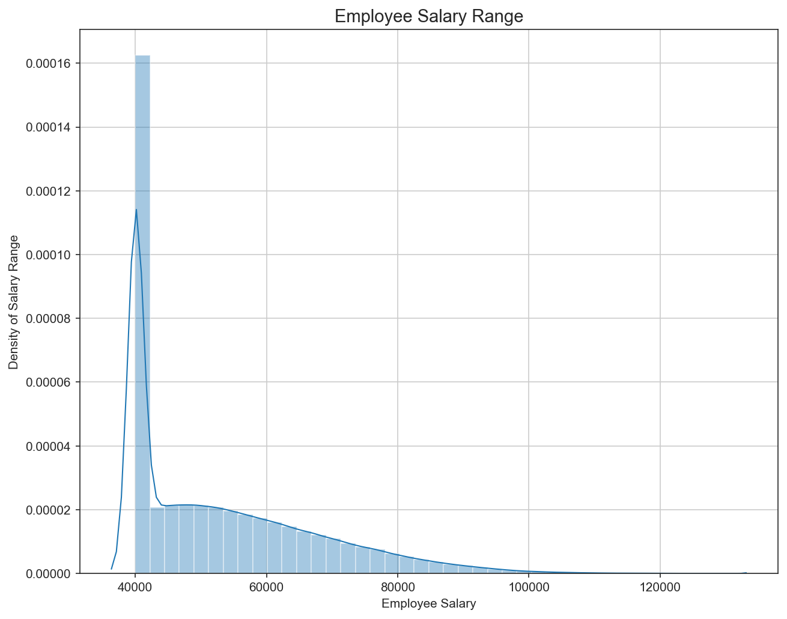
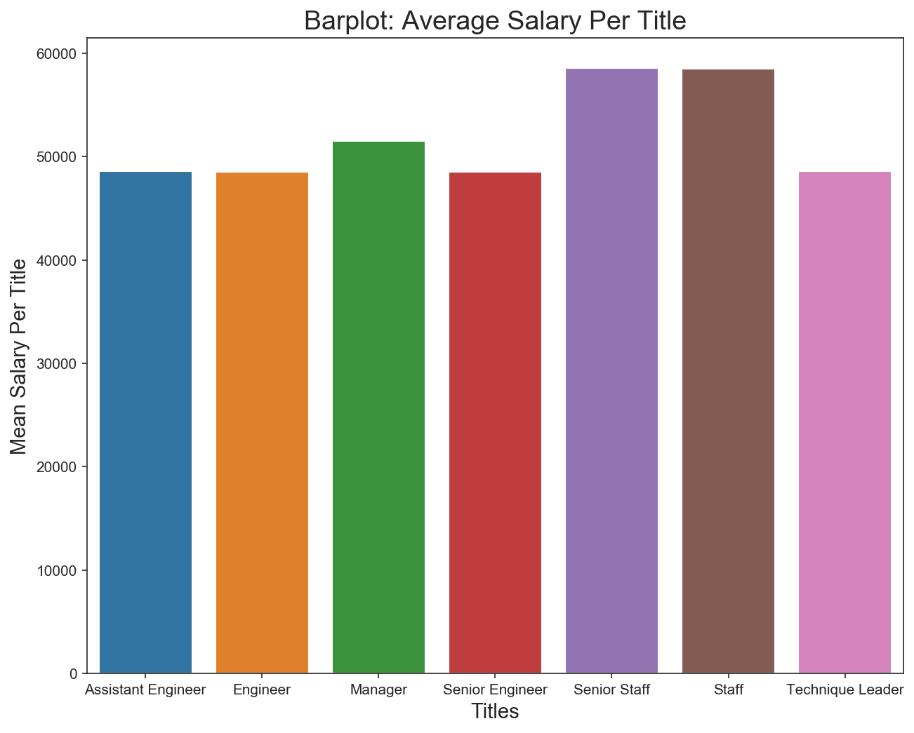

# sql-challenge
Researching the employees of the Pewlett Hackard corporation from the 1980s and 1990s. Data Engineering and Data Analysis.

In this assignment I designed the ERD and tables, to hold the six employee CSV files tha were provided. I imported the CSVs into PostgreSQL database tables and answered the provided questions about the data. In this project I performed:

1. Data Engineering

3. Data Analysis

# Bonus

As a bonus I imported the SQL database into Python/Jupyter Lab and created the above two plots. The plots display the distributed salary range of the employees from the 1980s and 1990s. The second bar chat displays the average salary among titles.